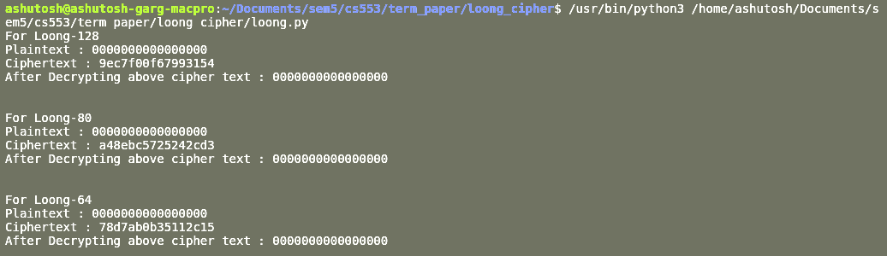

# Loong: A Family of Involutional Lightweight Block Cipher

## Motivation
Assignment of CS553 in IIT Bhilai. The purpose of this assignment is to learn about some well-known lightweight block ciphers and perform some analysis or observations on cipher and attack models.

## Group Name
YAnonymous

## Team Members
- Anmol Sagar (ID: 11840180)
- Ashutosh Garg (ID: 11840250)
- Prince Kumar Pansari (ID: 11840860)

## Link of Presentation Video
https://drive.google.com/file/d/1Mj6Q92zA36BNXA4qj6QcJCTO1ohMs2rK/view

## File name of Presentation
Loong_presentation.pdf

## File name of Term Paper
Loong_Termpaper.pdf

## Commands
### To run the implementation code
```sh
python3 loong.py 
```
### To create the LAT table, run
```sh
python3 lat.py 
```
### To create the DDT table, run
```sh
python3 ddt.py 
```

## Code Output
### loong.py


